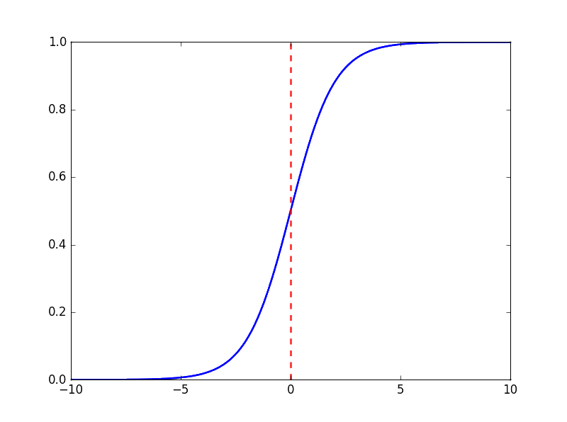
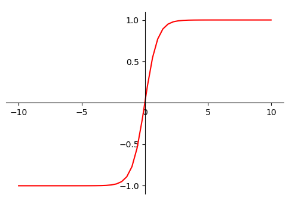
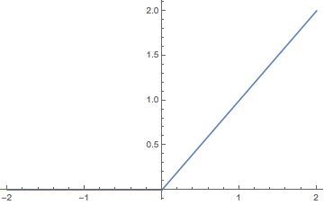

# AI
## 1. 样本不平衡的处理办法
**在实际生产中，各类别下的样本量几乎是不可能完全相等的，但是一点点的差异基本不会对最后的结果产生影响。但更多的是样本的不均衡。如在欺诈交易识别系统中，属于欺诈交易的部分应该是少部分，绝大部分交易都是正产的。如果类别不平衡的比例过大(一般为4:1)，那么分类器会大大地因为数据不平衡而无法满足分类要求。**

**解决办法**

- **扩大数据集**: 更多的数据集往往能够得到更多的特征信息，这也是当遇到样本分布不均的时候首先应该考虑的问题。
- **尝试其它的评价指标**: 准确度评估方式对类别不均衡的分类任务不能胜任，甚至可能误导我们的判断。这时应该考虑使用混淆矩阵(使用一个表格对分类器所预测的类别与其真实类别的样本统计，分别为TP， FN， FP， TN)，精确度，召回率等。
- **对数据进行重采样**:
  - **欠采样**: 随机删除观测数据中足够多的类，使得两个类别之间的相对比例是显著的。虽然这种办法非常简单，但是可能删除的部分包含了观测类的重要信息。
  - **过采样**: 对于不平衡的类，使用拷贝现有的样本方法随机增加观测数量。理想情况下这种办法给了我们足合成采样: 该技术用合成方法得到不平衡类别的观测，该技术与现有的使用近邻分类的方法类似。问题在于当一个类别的观测数量极度稀少时该怎么做。比如用图片分类问题确定一个稀有物种，但是可能只有一张这个稀有物种的图片。
  - **采用人工合成样本**: 一种简单的人工样本数据生产方法便是，对该类下的所有样本每个属性特征空间随机选择一个组成新的样本，即属性随机采样。可以使用经验值对属性值进行随机采样而构造新的人工样本，或者是用类似于朴素贝叶斯方法设置属性之间相互对立进行采样，这样便可得到更多的数据，但是无法保证属性之间的线性关系。
- **尝试不同的分类算法**
- **尝试对模型进行惩罚**

## 2. 数据增强的方法有哪些
**2.1.有监督的数据增强**

**有监督的数据增强即采用预设的数据变换规则，在已有数据的基础上进行数据的扩增，包括单样本数据增强和多样本数据增强。**

- 单样本数据增强:增强一个样本，全部围绕该样本进行操作，包括几何变换(几何变换包括翻转、旋转、裁剪、变形、缩放等)，颜色变换(包括噪声、模糊、颜色变换、擦除、填充等)。
- 多样本数据增强:多样本数据增强方法利用多个样本来产生新的样本。常见的多样本数据增强方法有SMOTE SamplePairing Mixup。三者在思路上有相同之处，都是试图将离散样本点连续化来拟合真实样本分布，不过所增加的样本点在特征空间中仍位于小样本点所围成的区域内。如果能够在给定范围外适当插值，也许能够实现更好的数据增强效果。

**2.2.无监督的数据增强**

**无监督的数据增强包括两类**

- 通过模型学习数据的分布，随机生成与训练数据集分布一致的图片，代表方法是GAN。
- 通过模型，学习出适合当前任务的数据增强方法，代表方法是AutoAugment。

## 3.什么是过拟合
过拟合就是在机器学习或者深度学习建模过程中，训练模型在训练样本中表现得很好，而在验证集以及测试集中表现不佳。这个时候模型的泛化能力很差。
## 4. 过拟合产生的原因
1. 训练集的数据量和模型的复杂度不匹配。训练集的数量小于模型的复杂度。
2. 训练集和测试集的特征分布不同。
3. 样本中噪声数据的干扰过大，大到模型过分记住噪声，反而忽略了真实输入输出之间的关系。
4. 权值学习迭代次数过多，拟合了训练数据中噪声和训练样本中没有代表性的特征。
## 5. 过拟合的解决办法

1. 调整模型的复杂度，使其适合自己训练集的数量级(包括缩小宽度和减小深度)。
2. 进行数据扩充，增加数据集的样本量，在计算机视觉领域，训练集越多，过拟合的概率越小。
3. 数据增强，增强的方式是对图像进行旋转、缩放、裁剪、添加噪声等。
4. 参数太多，会导致模型的复杂度上升，容易过拟合，同时使得模型的训练误差减小。通过正则化对模型的复杂度带来一定程度上的惩罚。正则化可以保持模型简单，另外，规则项的使用还可以约束模型的性能。
5. 使用dropout、dropout方法是ImageNet提出的一种方法。
6. 提前结束训练。
7. 重新清洗数据，在机器学习或者深度学习中，决定模型性能的上限是特征工程，任何算法或者神经网络的实现都是为了无限接近这个上限。所以，可以通过重新清洗数据来降低过拟合的情况。
## 6. 什么是欠拟合
欠拟合就是在训练集和测试集上都表现得很差。模型没有很好的捕捉到数据特征，不能够很好的拟合数据。同时欠拟合会出现高偏差问题(偏离正确结果)。
## 7. 欠拟合产生的原因
模型的复杂度不够，导致数据的很多特征没有学习到。
## 8. 欠拟合的解决办法
1. 添加其它特征项。
2. 添加多项式特征。例如：将现行的模型通过添加二次项或者三次项使模型使模型的泛化能力更强。
3. 减少正则化参数。正则化是用来防止过拟合的，但是现在模型出现了欠拟合，所以就需要减少正则化参数。
## 9. 正则化原理
- 正则化是对原函数引入额外的信息，使得目标函数变成原函数+额外项。该额外项可以在不同的时候改变相应的惩罚参数，这样就可以使目标函数产生稀疏的点并向最优解不断靠近而不至于对数据集产生依赖性从而达到降低过拟合的目的。
- 在正则化因子设置的足够大的情况下，为了使成本函数最小化，权重矩阵W就会被设置为接近于b的值，直观上相当于消除了很多神经元的影响，那么大的神经网路就会变成一个小的网络。加入正则化后当λ增大，导数就会减小，那么整个损失就会减小，同时减小了模型的复杂度。在损失接近于0的区域内，函数近似线性，所以每层的函数就会近似线性函数，整个网络就会成为一个简单的的近似线性的网络，因此不会发生过拟合。

## 10.常见的激活函数
**神经网络的每个神经元节点接收上一层神经元的输出作为本神经元的输入，并将这个输入值传递给下一层。如果不使用激活函数，那么每层节点的输入都是上一层输出的线性函数，很容易验证。并且无论有多少层神经网络，输出的都是线性的组合，这种网络的泛化能力相当有限。所以必须使用非线性的激活函数。**

***10.1.Sigmoid***

特点: 它能把输入的连续值转换为0-1之间的输出，特别的，如果非常大的负数，那么输出的就是0，如果非常大的正数，输出的就是1。

优点: 具有很好的及时性，将线性函数的组合输出为0-1 之间的概率。

缺点: 在神经网络的反向传播时容易导致梯度爆炸和梯度消失，其中梯度爆炸发生的可能性相对较小，但是梯度消失的可能性相对较大，因为Sigmoid函数是把反向传播传回的值映射到0-1之间之间，随着神经网络的层数加深，梯度会越来越小，最终消失。并且Sigmoid的output不是0均值，Sigmoid函数中含有幂运算，计算机在求解时相对来讲比较耗时。

公式：
$$
Sigmoid(x) = \frac{1}{1 + e^{-x}}
$$

求导:
$$
Sigmoid^′(x) = \frac {e^{-x}}{(1 + e^{-x})^2} = f(x)(1 - f(x))
$$

函数图像:

***10.2.Tanh***

特点: tanh函数可以把输入值映射到-1到1之间，于Sigmoid函数相比，它的输出均值为0，因此解决了Sigmoid输出均值不为0的问题，使其收敛速度比Sigmoid快，可以减少迭代次数。其缺点也是需要幂运算，计算成本高，而且同样存在梯度消失的问题，因此在Sigmoid函数两边都有趋近于0的情况。

优点: 正负方向与原点对称，输出均值为0，使其收敛速度比Sigmoid快，减少迭代次数。

缺点: 和Sigmoid函数一样，存在梯度消失的问题。

公式: 
$$
tanh(x) = \frac{e^{x} - e^{-x}}{e^{x} + e^{-x}}
$$

导数:
$$
tanh^′(x) = 1 - tanh(x)^2
$$

函数图像: 

***10.3.Relu***
特点: relu函数对于小于0的值全部抑制为0，对于正数则直接输出。相比Sigmoid和tanh，relu摒弃了复杂的计算，提高了运算速度。解决了梯度消失的问题，这样可以得到更好的模型。

优点: relu函数在大于0的部分梯度为常数，所以不会产生梯度弥散现象。同时relu函数速度快，只需要判断输入是否大于0。收敛速度远快于Sigmoid和tanh。

缺点: relu函数的争议出现在梯度值小于0的时候，因为relu函数的特点是在梯度小于0时将梯度赋值为0，这个时候就可能导致该神经元不会被其他激活函数激活的现象，如果这个情况发生，那么这个神经元的梯度永远为0。而在实际生产中，如果learning rate很大，那么很有可能网络中40%的神经元都已经dead了。

公式: 
$$
Relu(x) = Max(x, 0) = \begin{cases}
\text{0, x<=0}\\
\text{x, x>0}
\end{cases}
$$

导数:
$$
Relu^′(x) = Max(1, 0) = \begin{cases}
\text{0, x<=0}\\
\text{1, x>0}
\end{cases}
$$

函数图像:

***10.4.SoftMax***
把一堆实数映射到0-1之间，并使他们的和为1，可以理解为对应每个类别的预测概率。

公式:
$$
SoftMax(x) = \frac{e^{x_i}}{\sum_ie^{x_i}}
$$

## 11. 什么是梯度爆炸
梯度爆炸是由于初始化权值W过大，大到乘以激活函数的导数都大于1，随着神经网络深度加深，梯度权值会越来越大，最终导致梯度爆炸。

## 12. 梯度爆炸的解决办法
1. 裁剪梯度，设置一个梯度裁剪阈值，然后在更新梯度的时候，如果梯度超过这个阈值，那么就将其强制在这个范围内以防止梯度爆炸。
2. 数据归一化。
## 13. 什么是梯度消失(梯度弥散)
随着神经网络层数加深，梯度倾向于向越大和越小的两级分化方向前进，当往梯度减小的方向前进时就会导致梯度消失。
通常神经网络所用的激活函数是Sigmoid函数，Sigmoid函数容易引起梯度弥散。因为该函数将整个数值区间映射到0-1，并且这个函数求导之后的数值区间也是0-1。这样经过反向传播之后的数值会更小。再经过神经网络逐层对函数偏导相乘，就会变得越来越小，最终使得loss变为0，从而导致浅层权重得不到更新。
## 14. 梯度消失(梯度弥散)的解决办法
1. 使用relu、leaky-relu等激活函数代替Sigmoid激活函数
2. 用Batch Normalization
3. LSTM的结构设计可以改善RNN中梯度消失的问题
4. 使用预训练的模型进行迁移学习
5. 使用残差网络
## 15. 什么是特征归一化，它与标准化有何区别
标准化: 对数据的分布进行转换，使其符合某种分布(如正态分布)的一种线性特殊变换。
归一化: 对数据的数值范围进行特定的缩放，但不改变其数据分布的一种线性特征变换，一般做法是将数据范围压缩到(0,1)之间

归一化和标准化都能起到提高迭代求解收敛速度的作用，两者之间也确实有相交。但在我看来，标准化应该包括了归一化，而标准化可以映射到更大更多的区间。
## 16. 数据归一化的作用
数据归一化后，更容易正确的收敛到最优解，从而提升模型的精度。在深度学习中，数据归一化还能在一定程度上防止梯度爆炸。
## 17. AuC、RoC、Map、Recall、Precision F1-score
**混淆矩阵**
混淆矩阵衡量的是分类器分类的准确程度(分类可以是单个分类器，也可以是多个分类器)。其中包括4种算法：
- 真阳性(True Positive, TP): 样本的真实类别是正例，并且模型预测的结果也是正例
- 真阴性(True negative, TN): 样本的真实类别是负例，并且模型预测的结果也是负例
- 假阳性(False Positive, FP): 样本的真实类别是负例，但是模型将其预测为正例
- 假阴性(False Negative, FN): 样本的真实类别是正例，但是模型将其预测为负例

**混淆矩阵延伸出的各种评价指标**
- 正确率(Accuracy): 被正确分类的样本比例或数量--(TP + TN) / total
- 错误率(Misclassificaltion / Error Rate): 被错误分类的样本比例或数量--(FP + FN) / total
- 正阳绿(True Positive Rate): 分类器预测为整理的样本占实际正例的数量比例，也叫敏感度(sensitivity)或召回率(recall)，描述了分类器对正例类别的敏感程度
- 假阳率(False Positive Rate): 分类器预测为正例的样本占实际样本数量的比例
- 特异性(sepecificity): 实例是负例，分类器预测结果的类别也是负例的比例
- 精度(Precision): 在所有判断为正例的结果中，真正正例所占的比例
- 流行程度(Prevalence): 正例在样本中所占的比例

**RoC**
ROC是为了形象的衡量分类器的鲁棒性(无论选取多大的阈值，分类都能尽可能的正确)。定义为ROC曲线下方的面积，取值范围在0.5-1之间。
TPR = TP / (TP + FN)
FPR = FP / (FP + TN)
TPR: 表示实际的正样本被模型预测为正样本的概率(越大越好)
FPR: 表示实际的负样本被模型预测为正样本的概率(越小越好)
ROC: 曲线纵坐标是TPR，横坐标是FPR，绘制过程中设置不同的阈值点，当模型预测得分小于阈值的是否是负样本，否者为正样本。

**AuC**
AUC的原始定义是ROC下的面积，计算起来比较麻烦，从ROC的曲线可以看出，AUC不会超过1。同时对于相同的FPR，当TPR越大时，面积越大。即AUC越小。这也就是说、被模型预测为正的样本中，实际的额正样本越多越好，实际的负样本越少越好。从另一个角度说，AUC的物理意义就是：随机选出一个正负样本，模型对正样本的打分大于模型对负样本打分的概率。

由分类输出/结果 得到的一个值，衡量分类效果。AUC曲线下的面积是一个在0-1之间的值，曲线下面积AUC是指ROC曲线下面积。AUC直观反映了ROC曲线表达的分类能力。(AUC=1，代表完美分类器， 0.5<AUC<1，优于随机分类器，0<AUC<0.5差于随机分类器)

AUC的有点: 不受正负样本比例的影响，适合于排序业务，主要衡量一个模型的排序能力。
AUC的缺点: 没有关注模型预测的具体概率值，无法反映正样本内部的排序能力以及负样本内部的排序能力。

**Recall**
召回率 =  预测为真实正例的个数 / 所有真实正样本的个数

**Precision**
准确率 = 预测为真实正例 / 所有被预测为正例样本的个数

**mAP**
即各类别AP的平均值

**F1-Score**
F1-score是召回率和精确率的加权调和平均数，使为了调和召回率和精确率之间的增减反向矛盾。当recall越大时，预测的覆盖率越高，这样precision就会越小，反之亦然。通常，使用F1-score来调和Precision和recall。
## 18. MAE MSE RMSE R-Square
MAE(Mean Absolute Error): 是绝对误差的平均值。可以更好的反应预测值误差的实际情况。

MSE(Mean Square Eerror): 是真实值与预测值的差值的的平方然后求和平均。通过平方的形式便于求导，所以常被用作线性回归的损失函数。
RMSE(Root Mean Square Error): 衡量观测值与真实值之间的偏差。常用来作为机器学习模型预测结果衡量的标准。受异常点影响较大。

R-Square(决定系数): 分母理解为原始数据的离散程度，分子为预测数据和原始数据的误差，二者相除可以消除原始数据离散程度的影响。
## 19. 什么是偏差(bias)、方差(ariable)之间的均衡
偏差(Bias): 反应的是模型在样本上的输出与真实值之间的误差，计算的是模型本省的拟合能力。Bias可能导致模型欠拟合，使其难以具有较高的预测准确性。

方差(Variable): 描述的是通过学习拟合出来的结果自身的不稳定性。

Bias-Variance的分解，本质上是通过在基础数据集中添加偏差、方差和一点由噪声引起的不可约误差，来分级算法上的学习误差。从本质上讲，如果使模型更复杂并添加更多的变量，将会失去一些bais但获得一些Variance。
## 20. 监督学习和非监督学习有何不同
监督学习需要训练数据和测试数据。而无监督学习不需要明确标记数据
## 21. L1、L2正则之间的不同
**L1**
l1是模型各个参数的绝对值之和，L1会趋向于产生少量的特征，而其他的特征都是0.因为最优的参数值很大概率出现在坐标轴上，这样就会导致某一维度的权重为0，从而产生稀疏权重矩阵。
**L2**
l2是力模型各个参数平方和的开方值。l2会选择更多的特征，这些特征都会接近于0。最优的参数值很小概率会出现在坐标轴上，因此每一维的参数都不会是0。

## 22. 模型的精度和模型的性能哪个更重要
这一切都因为模型的准确性仅仅是模型新能的一个子集有关(因为模型性能的评价指标还有如召回率等)，在这点上，有时是一个误导。例如，想在一个拥有百万样本的海量数据集中监测欺诈行为，那么一个更准确的模型很有可能会预测，如果只有极少数案例是欺诈行为，那么根本就不会有欺诈行为。然而，对于预测模型来说，这是一个无用的----一个旨在发现声称没由于欺诈的模型！这样的问题可以证明模型的准确性，但不能证明模型的性能。

## 23. 如何处理数据集中丢失或者损坏的数据
可以在数据集中找到丢失/损坏的数据，然后删除这些行或列，或者决定用另一个值替代他们。在pandas中，有两种非常有用的方法。isNull() 和 dropna()， 这两种方法将帮助你查找缺失或损坏数据的数据列，并删除这些数据。如果要用占位符(例如0)填充无效值，可以使用fillna()方法。

## 24. 简述反向传播过程
做一个前馈运算，将模型输出与标签进行比较，计算误差；向后运行前馈运算，将误差分散到每个权重，以此来更新权重，得到一个更好的模型；持续这些步骤得到一个满意的步骤。

## 25. 什么是K折交叉验证
将原始数据集划分成K个子集，将其中一个子集作为验证集，其余k-1个子集作为训练集，如此训练和验证称为一次交叉验证。交叉验证重复K次，每个子集都做一次验证得到k个模型，加权平均k个模型的结果作为模型的整体评估依据。

## 26. 关于K折交叉验证需要注意什么
K越大，不一定效果越好，而且越大的K会加大训练时间；在选择K时，需要考虑最小化数据集之间的方差，比如对于2分类任务，采用2折交叉验证，即将原始数据集对半分，若此时训练集中都是A类别，验证集都是B类别，则交叉验证效果非常差。

## 27. 说明Lp范数间的区别
- L1范数: 向量中各个元素绝对值之和
- L2范数: 向量中各个元素平方和的二次根
- L3范数: 向量中各个元素绝对值的P次方和的开p次方根

## 28. 相比Sigmoid激活函数，Relu激活函数有何优势
1. 防止梯度消失(Sigmoid的导数只有在0附近的时候有比较好的及活性，在正负饱和区的梯度都接近于0)
2. Relu的输出具有洗属性
3. Relu函数简单，计算速度快

## 29. 非平衡数九的处理方法有哪些
- 采用更好的评价指标，例如F1-score、AuC曲线等，而不是Recall、Precision
- 进行过采样，随机重复少量类别的样本来增加它的数量
- 进行欠采样，随机对多类别样本降采样
- 通过在已有数据上添加噪声来生成新的数据
- 修改损失函数，添加新的惩罚项，使得小样本的类别被误判的损失增大，迫使模型重视小样本的数据
- 使用组合/集成方法解决样本不均衡，在每次生成训练集时使用左右分类中的小样本，同时从分类中的大样本量中随机抽取数据来与小样本量合并构成训练集，这样反复多次会得到很多训练集和验证集模型。最后在应用时，使用组合方法产生分类预测结果

## 30. 什么是生成对抗网络
- GAN之所以是对抗的，是因为GAN的内部是竞争关系，一方叫generator，他的主要工作是生成图片，并尽量使得其看上去是来自于训练样本。另一方面是discriminator，其目标是判断输入图片是否属于真实样本。
- 生成对抗网络的一个简单解释为，假设有两个模型，一个是生成模型，一个是判别模型，判别模型的任务是判断一个实例是真实的还是由模型生成的，生成模型的任务是生成一个实例来骗过判别模型，两个模型相互对抗，发展下去就会达到一个平衡，生成模型生成的实例与真实实例没有区别，判别模型无法区分生成模型是自然的还是生成的。
- 比如，将generator现象成假币制造商，而discriminator是警察。generator目的是尽可能把假币制造的跟真的一样，从而骗过discriminator。即生成样本并使它看上去好像来自于真实训练的样本一样。
- 再比如，以赝品商人为例，赝品商人(generator)制造出u假的毕加索化作来欺骗买家(discriminator)，赝品商人一直提高他的高仿水平来区分行家，行家也是一直学习真的假的毕加索化作来提升自己的辨识能力，双方一直博弈，最后赝品商人高仿的毕加索化作达到了以假乱真的水平，行家最后也很难区分正品和赝品了。

## 31. 特定场景下，如何做特征工程
- **根据先验经验人工挑选**: 如天气预测问题，可以先预先确定湿度、温度、是否有云、风向、风速、近几日天气状况等较为想难关的特征。
- **线性特征选择**: 假设特征之间相互独立，不存在交互，那么可以使用信息增益等方法逐个检验特征与结果之间的相关程度。更为简便地方法是使用LR等线性模型，先做一次预训练，研究特征对应的线性模型权值的绝对值大小来对特征的重要程度进行排序。
- **非线性特征选择**: 如果考虑特征之间的交互，可以使用随机森林来进行特征选择，概括来说就是将想要检验重要的特征在样本上进行permutation，然后观察OOB错误上升程度，上升越大，说明这个特征越重要。
- **自动特征提取**: 核技巧、集成学习、深度学习等较为复杂的算法都可以看做是特征提取的过程，虽然简单省力，但是模型的解释性也会下降，尤其像深度学习这种黑盒。

## 32. 梯度下降算法的缺点
- **SGD**: 选择合适的learning rate比较困难。对所有的参数更新使用同样的learning rate无法满足不同系数数据下的更新速度要求。SGD容易得到局部最优解，在某些情况下可能被困在鞍点。
- **全量梯度下降算法(Batch gradient descent)**: 全量梯度下降算法每次学习都使用整个训练集，因此每次更新都会朝着正确的方向进行，最后能保证收敛于极值点，凸函数收敛于全局极值点，非凸函数可能收敛于局部极值点，缺陷是每次迭代会计算每条数据的梯度，所以学习的时间太长，内存消耗大。
- **随机梯度下降算法(Stochastic gradient descent)**: SGD一轮迭代只随机选择一条数据，这种方式学习的速度会很快，缺点是每次更新可能并不是按正确的方向进行，参数更新具有高方差，从而导致损失函数剧烈波动。不够，如果目标函数具有盆地区域，SGD会使优化的方向从当前局部极小值跳到另一个更好的局部极小值点，这样对非凸函数，可能最终收敛于一个较好的局部极值点，甚至全局极值点。
- **Adagrad**: 对于训练神经网络模型而言，从训练开始时积累平方梯度值会越来越大，会导致学习率过早或过量减少，从而导致迭代后期收敛及其缓慢。
- **Adam**:

## 33. 如何对梯度下降算法进行调优

## 34. 随机梯度下降和批量梯度下降的区别

## 35. 各种梯度下降算法性能的比较

## 36. 如何判断一个模型是线性的还是非线性的
判断该模型的决策边界是线程的还是非线性的，即落到分界线上过的点在两边的概率是一样的

## 37. 模型评估的常用方法
- **分类模型的评估方法**: 
    - Accuracy--准确率
    - precision--精准度/查准率
    - recall--召回率/查全率
    - P-R曲线--查准率为纵轴，查全率为横轴
    - F1-Score
    - Confusion Matrix--混淆矩阵
    - ROC--ROC曲线
    - RUC--AUC曲线

- **回归模型的评估方法**:
    - Mean Square Error(MSE, RMSE)--平均方差
    - Absolute Error(MAE, RAE)--绝对误差
    - R-Squared--R平方值

## 38. 经验误差和泛化误差
- **经验误差**: 又称为训练误差，模型在训练集上的误差称为经验误差或者训练误差
- **泛化误差**: 模型在新样本集(测试集)上的误差称为繁华误差

## 39. 如何寻找超参数的最优值

## 40. 超参数搜索的一般过程

## 41. 为什么需要非线性激活函数

## 42. 如何选择激活函数

## 43. L1和L正则先验分别服从什么分布
- **L1**: 拉普拉斯分布
- **L2**: 高斯分布

## 44. 评价目标检测好坏的指标
- **交并比**: IoU，交并比是FCN网络预测的目标检测框和标签的标注框的交集和并集的比值，把这个比值设置为阈值，一般这个阈值设置为0.5，如果得到比值大于这个阈值就认为检测到目标。
- **平均准确率均值**: mAP，每个类别都可以根据recall(召回率)和preeecision(准确率)绘制一条曲线，那么AP就是该曲线下的面积，而mAP是多个类别AP的平均值，这个值介于0到1之间，且越大越好。这个指标是目标检测算法最为重要的一个。
- **模型的检测速度**: 模型的检测速度越快，代表目标检测模型越好。

## 45. Opencv底层读取视频的原理

## 46. 识别颜色为什么要从RGB转换到HSV，HSV相对RGB有什么优势
因为RGB通道并不能很直观的反映出物体的具体颜色信息，而相对于RGB空间，HSV空间能够非常直观的表达色彩的明暗，色调以及鲜艳程度，方便进行颜色间的对比。HSV中的颜色参数分别是H(代表色调)、S(代表饱和度)、V(代表亮度)。

## 47. 为什么gram(格拉姆)矩阵能代表图像的风格
feature map提取到的是抽象特征，而gram矩阵，就是各个feature map两两做内积，其实就是计算各个feature map的相关性。
以梵高的星空举例: 某一层中有一个滤波器专门检测尖尖的部分，另一个滤波器专门检测黑色。有一个滤波器专门检测椭圆形，另一个滤波器专门检测黄色。对于梵高的星空来讲，"尖尖"和"黑色"经常一起出现，它们的相关性比较高，而"椭圆"和"金黄色"经常一起出现，它们的相关性比较高。因此在风格转移的时候，其它的图片也会去寻找这种歌搭配。

## 48. 损失函数和代价函数的区别
**相同点**: 损失函数和代价函数的哦是用于衡量预测结果与真实值之间的误差
**区别**: 损失函数是在单个训练样本中定义的，它衡量了在单个样本上的表现。代价函数衡量的是在全体训练样本上的表现。

